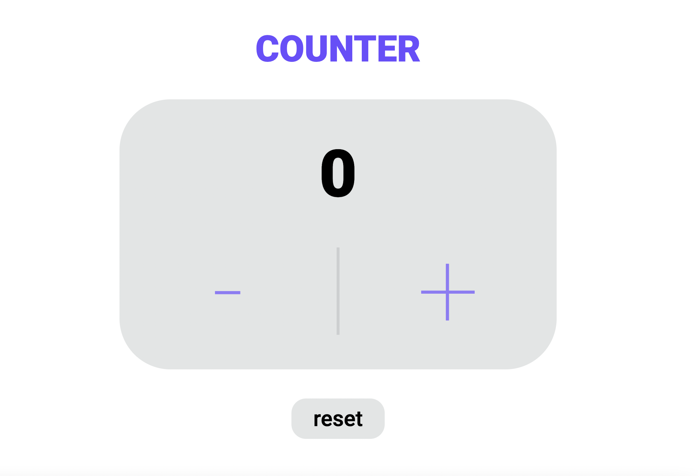

# **JavaScript Counter**
## _Js Basic +/- Counter_

***

## _**Languages**_

* HTML

* CSS

* SCSS

*  JAVASCRIPT 

***

## _**How this works**_

### •Increment or decrement the initial value (0) with +/- buttons.

### •Use reset button to come back to the initial value.

***

## _**GitHub Pages**_

### https://sofiamuladze.github.io/Counter/
